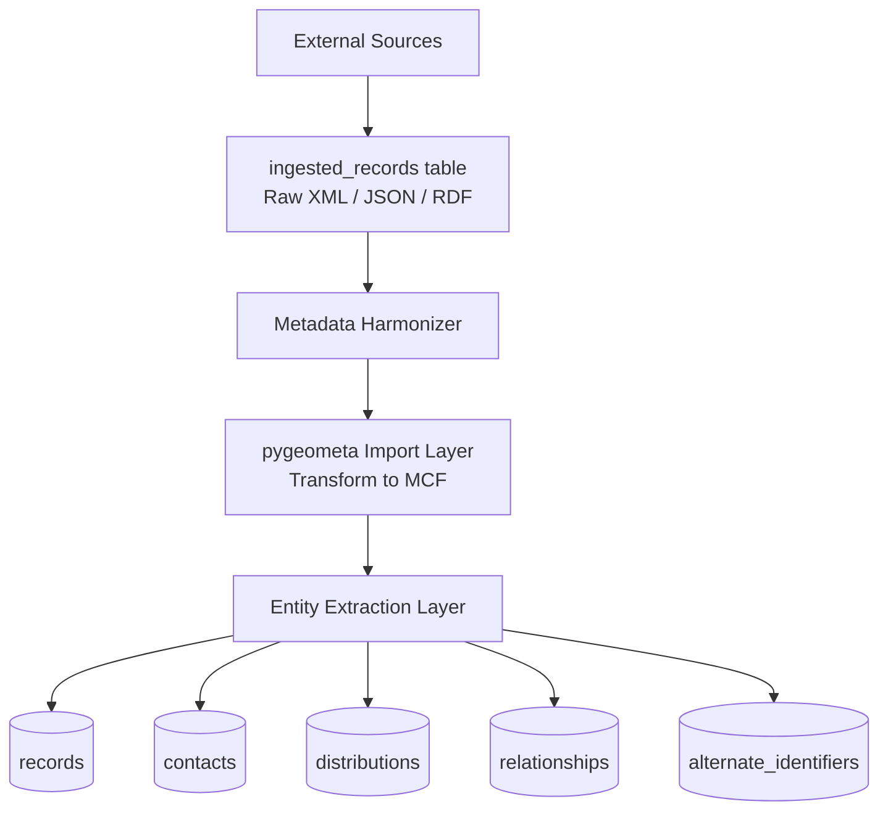

# Metadata Harmonization Component

## Overview

The Metadata Harmonization Component is responsible for transforming heterogeneous metadata records originating from multiple external systems into a unified relational data model.

The component ingests metadata records in different serialization formats such as XML, JSON, and RDF, normalizes them through a common intermediary representation, and persists the resulting entities into a structured relational schema optimized for querying, deduplication, and downstream data integration.

The primary goals of the component are:

* Normalize metadata from heterogeneous source systems
* Provide a consistent relational representation of metadata entities
* Deduplicate metadata records and contacts across sources
* Preserve provenance and relationships between records
* Support metadata enrichment and harmonization workflows
* Enable efficient querying and analytics on metadata content


# Architecture

## High-Level Workflow

The harmonization pipeline consists of the following stages:

1. Metadata ingestion
2. Raw content retrieval
3. Format normalization
4. MCF transformation
5. Relational entity extraction
6. Deduplication and merge processing
7. Persistence into harmonized relational tables



# Source Metadata Ingestion

## Ingested Records Table

The harmonization component retrieves source metadata from the `ingested_records` table.

Each row in this table represents a single ingested metadata document originating from an external provider or harvesting process.

Typical columns include:

| Column              | Description                                |
| --- | ---  |
| `identifier`        | Internal ingestion identifier              |
| `source`            | Name of the originating source             |
| `content_type`      | MIME type or serialization format          |
| `raw_content`       | Original XML, JSON, or RDF payload         |
| `ingested_at`       | Timestamp of ingestion                     |
| `hash`              | MD5 hash of the ingested content           | 


## Supported Metadata Formats

The component currently supports metadata records serialized as:

* XML (ISO 19115, Dublin Core)
* JSON (STAC, OpenAire)
* RDF (DCAT, schema.org)

The ingestion layer is intentionally format-agnostic. All source records are transformed into a common internal representation before relational processing occurs.


# Metadata Normalization

## pygeometa Integration

The component uses the [pygeometa library](https://geopython.github.io/pygeometa/tutorial/) to normalize heterogeneous metadata records into MCF (Metadata Control File) format.

MCF acts as the canonical intermediate representation within the harmonization pipeline.

### Benefits of MCF

Using MCF as an intermediary format provides several advantages:

* Decouples source-specific parsing from relational transformation
* Provides a stable internal metadata representation
* Simplifies support for additional source formats
* Enables schema-independent harmonization logic
* Reduces downstream transformation complexity

## Transformation Process

The normalization workflow consists of:

1. Detecting the source metadata format
2. Selecting the appropriate pygeometa importer
3. Parsing the raw metadata payload
4. Converting the metadata into MCF
5. Validating the generated MCF structure
6. Passing the normalized representation to the relational extraction layer


# Relational Data Model

## Overview

After normalization to MCF, the component extracts structured entities and persists them into a relational schema.

The schema is designed to:

* Eliminate duplication
* Preserve relationships between entities
* Support efficient joins and search operations
* Enable provenance tracking
* Facilitate metadata synchronization across providers

## Core Tables

The harmonized relational schema persists normalized metadata entities into dedicated tables.

The schema separates records, contacts, organizations, relationships, subjects, and distributions into reusable relational entities.

### records

The `records` table stores the primary harmonized metadata entity.

| Field               | Description                           |
| ------------------- | ------------------------------------- |
| `identifier`        | Canonical metadata identifier         |
| `md_lang`           | Metadata language                     |
| `md_date`           | Metadata creation or update timestamp |
| `harvest_date`      | Harvest timestamp                     |
| `source`            | Originating source system             |
| `title`             | Resource title                        |
| `abstract`          | Resource abstract or description      |
| `language`          | Resource language                     |
| `edition`           | Resource edition                      |
| `format`            | Metadata or resource format           |
| `type`              | Resource type                         |
| `revisiondate`      | Resource revision timestamp           |
| `creationdate`      | Resource creation timestamp           |
| `publicationdate`   | Resource publication timestamp        |
| `embargodate`       | Embargo expiration date               |
| `resolution`        | Spatial resolution. Use resolution when resolution is known in ground units, data is raster or sensor-based |
| `denominator`       | Scale denominator. Use scale when data was compiled or intended for a specific map scale |
| `accessconstraints` | Access restrictions                   |
| `license`           | Usage license                         |
| `rights`            | Rights statement                      |
| `lineage`           | Provenance or lineage statement       |
| `spatial`           | Spatial geometry or extent            |
| `spatial_desc`      | Human-readable spatial description    |
| `datamodel`         | Referenced data model                 |
| `temporal_start`    | Temporal extent start, start of period when the data has been collected, observed, predicted for or legally binding |
| `temporal_end`      | Temporal extent end                   |
| `thumbnail`         | Thumbnail URL                         |
| `raw_mcf`           | Serialized MCF representation         |


### records_failed

The `records_failed` table stores metadata records that failed harmonization.

| Field        | Description                |
| ------------ | -------------------------- |
| `identifier` | Source metadata identifier |
| `hash`       | Content hash               |
| `error`      | Processing error details   |
| `date`       | Failure timestamp          |

This table supports diagnostics and reprocessing workflows.

### records_processed

The `records_processed` table tracks successfully processed records.

| Field        | Description                  |
| ------------ | ---------------------------- |
| `identifier` | Original metadata identifier |
| `hash`       | Metadata content hash        |
| `source`     | Source system                |
| `final_id`   | Final harmonized identifier  |
| `mode`       | Processing mode              |
| `date`       | Processing timestamp         |

This table provides processing traceability and incremental synchronization support.

### person

The `person` table stores deduplicated person entities.

| Field   | Description         |
| ------- | ------------------- |
| `id`    | Internal identifier |
| `name`  | Full name           |
| `alias` | Alternate name      |
| `email` | Email address       |
| `orcid` | ORCID identifier    |

### organization

The `organization` table stores deduplicated organizational entities.

| Field                | Description                               |
| -------------------- | ----------------------------------------- |
| `id`                 | Internal identifier                       |
| `name`               | Organization name                         |
| `alias`              | Alternate organization name               |
| `phone`              | Contact phone number                      |
| `ror`                | Research Organization Registry identifier |
| `address`            | Street address                            |
| `postalcode`         | Postal code                               |
| `city`               | City                                      |
| `administrativearea` | Administrative region                     |
| `country`            | Country                                   |
| `url`                | Organization website                      |

### contact_in_record

The `contact_in_record` table associates persons and organizations with metadata records.

| Field             | Description             |
| ----------------- | ----------------------- |
| `id`              | Internal identifier     |
| `fk_organization` | Referenced organization |
| `fk_person`       | Referenced person       |
| `record_id`       | Related metadata record |
| `role`            | Metadata contact role   |
| `position`        | Organizational position |

This structure supports:

* Many-to-many contact relationships
* Shared contacts across records
* Role-specific contact assignments

### subjects

The `subjects` table stores controlled vocabulary concepts and keywords.

| Field            | Description                |
| ---------------- | -------------------------- |
| `id`             | Internal identifier        |
| `uri`            | Subject URI                |
| `label`          | Human-readable label       |
| `thesaurus_name` | Controlled vocabulary name |
| `thesaurus_url`  | Controlled vocabulary URL  |

### record_subject

The `record_subject` table associates metadata records with subjects.

### attributes

The `attributes` table stores dataset attribute or variable definitions.

| Field       | Description             |
| ----------- | ----------------------- |
| `id`        | Internal identifier     |
| `record_id` | Related metadata record |
| `name`      | Attribute name          |
| `title`     | Human-readable title    |
| `url`       | Reference URL           |
| `units`     | Measurement units       |
| `type`      | Attribute datatype      |

### relations

The `relations` table stores relationships between records and external identifiers.

| Field        | Description            |
| ------------ | ---------------------- |
| `id`         | Internal identifier    |
| `record_id`  | Source metadata record |
| `identifier` | Related identifier     |
| `scheme`     | Identifier scheme      |
| `type`       | Relationship type      |

Examples include:

* Parent-child relationships
* DOI references
* Service links
* Related publications
* Derived datasets

### sources

The `sources` table stores metadata provider definitions.

| Field         | Description        |
| ------------- | ------------------ |
| `name`        | Source system name |
| `description` | Source description |

### record_sources

The `record_sources` table maps harmonized records to contributing metadata providers.

This supports provenance tracking for merged metadata records.

### record_in_project

The `record_in_project` table associates records with projects or initiatives.

| Field       | Description                |
| ----------- | -------------------------- |
| `record_id` | Metadata record            |
| `project`   | Project identifier or name |

### alternate_identifiers

The `alternate_identifiers` table stores additional identifiers associated with a metadata record.

| Field            | Description          |
| ---------------- | -------------------- |
| `record_id`      | Metadata record      |
| `alt_identifier` | Alternate identifier |
| `scheme`         | Identifier scheme    |

Alternate identifiers are heavily used during record deduplication and merge processing.

### distributions

The `distributions` table stores downloadable resources and service endpoints.

| Field         | Description              |
| ------------- | ------------------------ |
| `id`          | Internal identifier      |
| `record_id`   | Related metadata record  |
| `name`        | Distribution title       |
| `format`      | Distribution format      |
| `url`         | Access URL               |
| `description` | Distribution description |

### employment

The `employment` table models relationships between persons and organizations.

| Field             | Description               |
| ----------------- | ------------------------- |
| `person_id`       | Referenced person         |
| `organization_id` | Referenced organization   |
| `role`            | Employment role           |
| `start_date`      | Employment start date     |
| `end_date`        | Employment end date       |
| `source`          | Metadata source           |
| `date`            | Record creation timestamp |

This structure enables reusable organization affiliations across metadata records.

---|---|
| `record_id` | Internal harmonized identifier |
| `identifier` | Canonical metadata identifier |
| `title` | Resource title |
| `abstract` | Resource description |
| `resource_type` | Dataset, document, service, etc. |
| `publication_date` | Publication timestamp |
| `modified_date` | Last modification timestamp |
| `source_priority` | Source precedence indicator |
| `created_at` | Harmonization timestamp |
| `updated_at` | Last update timestamp |

### Contacts Table

The `contacts` table stores deduplicated contact entities.

Typical fields include:

| Field          | Description                 |
| -------------- | --------------------------- |
| `contact_id`   | Internal contact identifier |
| `name`         | Contact name                |
| `organization` | Organization name           |
| `email`        | Email address               |
| `phone`        | Telephone number            |
| `url`          | Contact website             |
| `role`         | Metadata role               |

### Record Contacts Table

The `record_contacts` association table links records to contacts.

This table supports many-to-many relationships between metadata records and contacts.

### Distributions Table

The `distributions` table stores downloadable or accessible resource endpoints.

Typical fields include:

| Field             | Description                      |
| ----------------- | -------------------------------- |
| `distribution_id` | Internal distribution identifier |
| `record_id`       | Parent metadata record           |
| `url`             | Distribution URL                 |
| `format`          | File or service format           |
| `protocol`        | Access protocol                  |
| `name`            | Distribution title               |
| `description`     | Distribution description         |

### Relationships Table

The `relationships` table captures links between metadata records.

Supported relationship types may include:

* Parent-child relationships
* Dataset-series membership
* Service-to-dataset linkage
* Version relationships
* Derived-from relationships
* Related-document references

Typical fields include:

| Field               | Description                      |
| --- | --- |
| `relationship_id`   | Internal relationship identifier |
| `source_record_id`  | Originating record               |
| `target_record_id`  | Related record                   |
| `relationship_type` | Semantic relationship type       |

### Alternate Identifiers Table

The `alternate_identifiers` table stores non-canonical identifiers associated with a record.

These identifiers are critical for cross-system deduplication.

Typical examples:

* DOI
* UUID
* Catalog identifiers
* Legacy identifiers
* Source system identifiers

# Deduplication Strategy

## Record Deduplication

Metadata records originating from different systems may describe the same real-world resource.

The harmonization component performs record-level deduplication using:

* Canonical identifiers
* Alternate identifiers
* Cross-reference matching

## Identifier Resolution

During harmonization:

1. The canonical identifier is extracted from the MCF
2. Alternate identifiers are extracted
3. Existing harmonized records are searched
4. Matching identifiers trigger merge processing

Example:

```text
Source A:
  identifier = dataset-001

Source B:
  alternateIdentifier = dataset-001

=> Both records resolve to the same harmonized entity
```

## Merge Semantics

When multiple metadata records describe the same resource, their metadata is merged into a single harmonized representation.

The current merge policy follows a:

> first-in-takes-lead per property

strategy.

This means:

* The first successfully harmonized value for a property becomes authoritative
* Subsequent records may supplement missing properties
* Existing populated properties are not overwritten by later records

Example:

```text
Record A:
  title = "Land Cover Dataset"
  abstract = null

Record B:
  title = "CORINE Land Cover"
  abstract = "European land cover dataset"

Merged Result:
  title = "Land Cover Dataset"
  abstract = "European land cover dataset"
```

This strategy preserves stable metadata while still allowing enrichment from additional providers.

## Future Merge Enhancements

Potential future improvements include:

* Source trust ranking
* Property-level provenance tracking
* Temporal precedence rules
* Confidence scoring
* Human-assisted conflict resolution
* Semantic similarity matching
* Configurable merge strategies


# Contact Deduplication

## Shared Contact Resolution

Many metadata records reference the same organizations or individuals.

To avoid duplication, contacts are harmonized independently from records.

If multiple records reference the same contact entity, only a single contact row is stored.

## Contact Matching

Contacts may be matched using:

* Email address
* Organization name
* Contact URI
* Combination of normalized fields

## Benefits

Contact deduplication provides:

* Reduced storage duplication
* Improved consistency
* Easier organization-level querying
* Simplified maintenance
* Better graph connectivity across records

Example:

```text
Dataset A -> European Environment Agency
Dataset B -> European Environment Agency

=> Single harmonized contact entity
```


# Relationship Harmonization

## Cross-Record Linkage

The component preserves semantic relationships between records whenever possible.

Examples include:

* Dataset belongs to a series
* Service exposes a dataset
* Document describes a dataset
* Dataset derived from another dataset

Relationships are normalized into explicit relational links.

## Benefits

Relationship harmonization enables:

* Graph traversal
* Resource lineage analysis
* Dependency tracking
* Collection navigation
* Semantic querying


# Processing Lifecycle

## Harmonization Run

A typical harmonization cycle consists of:

1. Retrieve unprocessed ingested records
2. Parse raw metadata content
3. Convert metadata into MCF
4. Extract relational entities
5. Deduplicate records and contacts
6. Merge metadata when required
7. Persist harmonized entities
8. Update processing status and provenance

## Error Handling

The harmonization process should isolate failures at the record level.

Typical error categories include:

* Invalid XML or JSON
* Unsupported metadata schema
* pygeometa conversion failures
* Identifier conflicts
* Database constraint violations

Failed records should:

* Be marked with processing status
* Retain original raw content
* Store detailed error information
* Remain eligible for reprocessing


# Provenance and Traceability

## Source Preservation

Although records are merged into harmonized entities, provenance information should remain traceable.

Recommended provenance tracking includes:

* Original source system
* Source identifiers
* Harvest timestamps
* Processing timestamps
* Merge contributors
* Property origin attribution

## Benefits

Provenance preservation enables:

* Auditability
* Reprocessing
* Source quality evaluation
* Conflict analysis
* Synchronization diagnostics


# Scalability Considerations

## Incremental Processing

The component should support incremental harmonization runs.

Typical strategies include:

* Processing only new or updated ingested records
* Using change timestamps
* Batch-oriented synchronization
* Queue-driven processing

## Performance Optimization

Recommended optimizations include:

* Identifier indexing
* Batched database writes
* Streaming XML parsing
* Parallel ingestion pipelines
* Cached contact resolution
* Deferred relationship reconciliation


# Extensibility

## Adding New Metadata Formats

Support for additional metadata formats can be introduced by:

1. Implementing a pygeometa-compatible importer
2. Mapping the source format to MCF
3. Extending extraction mappings if necessary

Because the relational transformation operates on MCF, most downstream logic remains unchanged.

## Custom Merge Policies

Future versions may support configurable merge policies such as:

* Source-priority merge
* Most-recent-value wins
* Weighted confidence merge
* Field-level merge strategies
* Provider-specific rules

